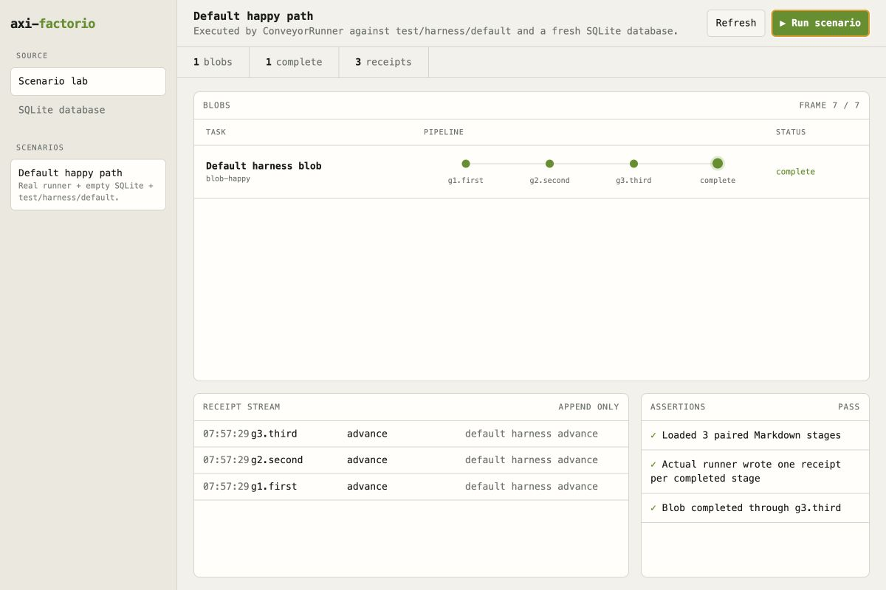

# axi-factorio

> **Work in progress.** This is an early public release candidate. The storage
> model, CLI, harness lifecycle, and UI are still being actively shaped.



`axi-factorio` is a deliberately dumb local blob conveyor. Blobs move downward
through ordered steps defined by ordinary Markdown files in Git. SQLite stores
runtime state and one receipt for every execution.

There is no workflow DSL, pipeline-version object, event bus, dependency graph,
or durable-workflow engine.

## Internal development workbench

The source repo contains a scenario lab for developing axi-factorio itself:

```sh
npm run workbench
```

Then open `http://127.0.0.1:4318`. Use `-- --db path/to/factorio.db` to inspect
a specific runtime database. The scenario lab and database inspector render
through the same conveyor, receipt-stream, and assertion views.

Port `4317` belongs to the installed user viewer. The Workbench defaults to
`4318` and refuses to start on the configured viewer port. When the viewer uses
a non-default port, pass it with `-- --viewer-port <port>`.

Installed-runtime proofs must never use the consuming workspace database. Create
an isolated temporary proof location with `createInstalledRuntimeProof()` and
pass its `databasePath` explicitly to every proof CLI/service invocation. The
guard rejects the configured live database path.

The Harness Lab is an operable deterministic mock environment. Its Play, Step,
Stop, Retry, Feedback, Approve, Fail, and Restart controls call the production
runner/store boundary against a temporary SQLite database. It exposes blob and
step state, receipt attempts, artifact references, stable external-run IDs, and
the append-only execution-event timeline after every action. It is mock proof,
not evidence that Codex or another real harness executed successfully.

The default happy-path scenario calls `createTestHarness()`, loads the paired
definitions in `test/harness/default/`, creates a fresh temporary SQLite
database, and moves a blob through the real `ConveyorRunner`.

The Live agent sessions scenario is deliberately time-based. Play starts a
slow deterministic agent harness through the production Store and Runner,
activity updates while its receipt remains running, the first attempt requests
a retry, and the second attempt advances through the same external session.
Reset recreates the temporary database. It uses the same execution-telemetry
component as the installed Viewer.

The workbench is not included in the release artifact or exposed as an
installed CLI command. The installed service has a separate user
view: project-grouped task rows, pipeline beads, status, and execution controls. Raw
receipts, assertions, scenario playback, and database paths stay in the source
workbench.

## Model

The database has six small concerns:

- `projects` separates each app working root from its shared pipeline-definition
  root and stores a default pipeline selector;
- `blobs` stores incoming work and its current conveyor position;
- `receipts` records every step execution and its definition identity;
- `executionEvents` appends generic harness lifecycle events;
- `humanInputs` appends review, feedback, and approval evidence; and
- `dispatcherLeases` ensures one local runner owns execution at a time.

`blob.state` is conveyor position, not execution status. A blob on the default
test harness moves through `g1.first`, `g2.second`, `g3.third`, then
`complete`. Running, failed, blocked, retry, and interrupted are receipt
statuses. A failed or blocked blob remains positioned at the responsible step
and is paused until explicitly retried.

Each receipt includes the blob ID, stable step ID, status, timestamps, harness,
definition Git SHA, definition content hash, input/output artifact references,
and external harness run ID when available. Rewound receipts remain visible with an
`invalidatedAt` timestamp.

Human-gated work can remain on one step and one external harness run across
multiple feedback cycles. Each resumed receipt snapshots the fresh human input,
the reused run ID, and any approval evidence.

## Pipeline files

A pipeline is a directory of paired Markdown files:

```text
0.plan.define.entry.md
0.plan.define.exit.md
1.plan.research.entry.md
1.plan.research.exit.md
2.dev.workbench.entry.md
2.dev.workbench.exit.md
```

The number controls ordering. The stable step ID excludes it: the examples
above are `plan.define`, `plan.research`, and `dev.workbench`. Changing a number
reorders a step without changing its identity.

Definitions are read when a blob becomes runnable:

- changing an unexecuted step uses the current file;
- inserting a step before the last completed step does not pull a blob back;
- adding steps after a completed blob does not reopen it; and
- `rewind` or `kick` explicitly moves a blob to a named step and invalidates
  receipts for that step and everything after it.

The files are the authority. The database records the pipeline identity selected
for each blob, such as `default/v1`, but contains no pipeline definition objects
or frozen step arrays. A receipt captures the exact Git SHA and combined
entry/exit SHA-256 content hash used for that execution.

## Agent harness contract

The runner depends on a narrow `AgentHarness` interface. A harness is selected
outside pipeline definitions with `--harness` or `AXI_FACTORIO_HARNESS`. It
receives the blob, current step definition, artifact references, human input,
and approval evidence. The contract defines:

- start and same-step resume;
- graceful cancellation;
- optional external-run reconciliation;
- structured status, external-run, and artifact events; and
- a terminal `advance`, `retry`, or `blocked` decision with reason and artifacts.

Pipeline Markdown never selects or names an agent. The shipped service defaults
to the replaceable `codex` harness, while
`module:SPECIFIER[#EXPORT]` loads another package or module implementing the
same contract:

```sh
npx axi-factorio service install --harness module:@example/my-harness#createHarness
```

Codex is one harness implementation. It runs the entry prompt with `codex exec --json`,
records the Codex thread ID, and resumes that same thread with the exit prompt.
When fresh human input is appended at the current step, the next receipt resumes
that same Codex thread before evaluating the exit prompt again.

Continuation is intentionally step-scoped: retries, blocked reviews,
feedback, and approval cycles reuse the current step's Codex thread, while the
next pipeline step starts a fresh thread. This preserves phase isolation but
repays Codex's startup context cost at every step. Reusing one blob-owned thread
across ordinary steps is a separate harness-lifecycle decision, not an implicit
behavior.

The Codex harness reconciles known external thread IDs through the Codex
app-server lifecycle. Two matching terminal observations are required before a
provider process is cancelled and its receipt fails. `notLoaded` alone means
the thread is unloaded, not failed; an interrupted or failed latest turn is
terminal only when it has genuine terminal evidence. A fresh incomplete turn
remains active even when an unloaded app-server snapshot temporarily labels it
interrupted. An incomplete turn with no activity for five minutes may
terminalize. The failed attempt remains append-only and paused. An explicit
`retry` creates a new receipt that resumes the same external thread ID. Service
restart recovery also terminalizes and pauses orphaned running receipts instead
of silently auto-running them.

Each Codex harness invocation uses `--ignore-user-config`. Authentication still
comes from `CODEX_HOME`, while unrelated user-configured MCP servers and
app-specific integrations are excluded from Factorio stages. Pipeline prompts
and the project working directory remain authoritative; Factorio does not
silently add provider tools.

The installed service resolves `codex` from the consuming workspace's pinned
`node_modules/.bin` before any system installation. This keeps launchd on the
same CLI contract verified by the package and disposable proofs.

All fresh and resumed Codex prompts are passed after the CLI `--` option
terminator. Editable prompts may therefore begin with Markdown rules or
option-like text without being parsed as command-line flags.

Optional instrumentation uses the same module selector form with
`--instrumentation`. It receives OpenTelemetry-compatible boundary event names
and attributes, but rc.10 does not ship or claim an OpenTelemetry exporter.
OMP is not integrated or imported; it can be added later as an independent
harness package.

## Requirements

- Node.js 23.6 or newer for native TypeScript execution and `node:sqlite`;
- an installed and authenticated `codex` CLI only when selecting the included
  Codex harness;
- pipeline definitions inside a Git repository; and
- macOS or Linux. Windows is rejected because safe process-tree termination
  cannot be guaranteed.

## Install

Build an installable release candidate:

```sh
npm run build
```

This recreates `release/` with:

- `axi-factorio-0.1.0-rc.32.tgz`, the installable package;
- `SHA256SUMS`, for artifact verification; and
- `INSTALL.md`, with direct and vendored installation commands.

Do not use `npm link` for a consuming project. Install the exact tarball so
`package.json` and its lockfile identify the tested release candidate.

## Commands

Install the exact candidate in the consuming npm project:

```sh
npm install --save-exact /path/to/axi-factorio-0.1.0-rc.32.tgz
```

From the consuming project root, the defaults are:

```text
pipeline name:  default
pipeline:       ./pipelines/default/<highest-vN>
database:       ./pipelines/axi-factorio.db
```

Adding a blob resolves the highest numbered version currently present and saves
that concrete identity in SQLite. For example, if `v1` and `v2` exist, a new
blob stores `default/v2`; existing blobs remain pinned to the version selected
when they were created. A future `./.factorio` file may override these defaults.

Every blob belongs to a project. A project stores the app working root, a
separate shared pipeline-definition root, and a default pipeline selector.
Register or update each app explicitly:

```sh
npx axi-factorio project upsert example "Example" \
  --root ./apps/example \
  --pipeline-root ./pipelines \
  --pipeline default
npx axi-factorio project list
npx axi-factorio project show example
```

Add a blob with a caller-owned join ID:

```sh
npx axi-factorio add account-export-1 "Add account export" \
  --project example \
  --body-file ./ticket.md \
  --input-ref ticket:account-export-1
```

`--input-ref` may be repeated. `--mint` generates an ID. Repeating an identical
add is an idempotent no-op.

Request continuous execution, exactly one transition, or a graceful stop:

```sh
npx axi-factorio play account-export-1
npx axi-factorio step account-export-1
npx axi-factorio stop account-export-1
```

`play` persists a continuous run request. The service keeps claiming automatic
steps until the blob reaches a human gate, fails, is stopped, or completes.
`step` persists debug mode and permits exactly one harness receipt before
stopping again. `stop` cancels queued work immediately; if a harness call is
already running, that receipt is allowed to finish and no following transition
is claimed. Mode and run-request state survive service and machine restarts.
Repeated identical requests are idempotent, and the dispatcher lease prevents
duplicate concurrent claims.

The Viewer hides manual execution controls during normal operation. Open
Settings and enable Debug mode to stop queued continuous runs at their next
safe boundary and expose Step, Play, and Stop controls. While Debug mode is on,
continuous Play is disabled and each Step authorizes exactly one transition.
Overview remains the pipeline board; Projects summarizes configured roots and
pipelines, Runs contains execution diagnostics, and Alerts collects failures
and work requiring attention. Zero-receipt held work is described as Inventory
only in the state-marker tooltip. Collapsing a project replaces its task rows
with one aggregate pipeline; each ring shows the percentage of that project's
tasks with a valid successful receipt for the corresponding step.

Process one requested transition or keep the conveyor service moving:

```sh
npx axi-factorio run
npx axi-factorio service
```

The foreground service owns both the automated runner and the web
view at `http://127.0.0.1:4317`. Install it as a macOS user service from the
consuming project root:

```sh
npx axi-factorio service install --harness codex
npx axi-factorio service status
npx axi-factorio service uninstall
```

The named service is the sole dispatcher owner. During replacement it waits
for an earlier lease to expire instead of entering a restart loop. Viewer
discovery isolates projects whose pipeline folders have disappeared: the
project is labelled `Pipeline unavailable`, healthy projects remain visible,
and the structured `viewer.pipeline_unavailable` event records the
`isolated_project` disposition.

Inspect state and receipts:

```sh
npx axi-factorio
npx axi-factorio list --state plan.define
npx axi-factorio show account-export-1 --full
npx axi-factorio receipts account-export-1 --full
```

Restart a blob paused by a failed or blocked receipt:

```sh
npx axi-factorio retry account-export-1
```

Adopt existing work at a later step by attesting every completed prior step:

```sh
npx axi-factorio adopt account-export-1 workbench.review \
  --source git-sha:0123456789abcdef \
  --evidence plan.define=review:plan \
  --evidence dev.build=commit:0123456789abcdef \
  --evidence qa.check=test-run:4821
```

The source must be an explicit `kind:value` identity, and every prior step must
have at least one `STEP_ID=REF` evidence value in pipeline order. Adoption is
only allowed before any receipts exist. It writes completed receipts marked
`executionKind: imported` and `adapter: attested-import`; it never claims an
automation run occurred.

Append iterative human review input at the current step:

```sh
npx axi-factorio review account-export-1 --note "Await Workbench review"
npx axi-factorio feedback account-export-1 "Reduce the visual chrome" \
  --evidence voice-note:1
npx axi-factorio approve account-export-1 \
  --note "Approved at exact head" \
  --evidence git-head:abc123
```

Feedback and approval unpause the blob so the service can resume its current
external task. Approval requires at least one evidence reference. The prompt
still decides whether the step passes; Factorio only supplies and records the
human evidence.

Relocating an existing blob to a new app workspace is deliberate and audited:

```sh
npx axi-factorio relocate account-export-1 \
  --root ./apps/example \
  --evidence git-head:abc123
```

The target must exist, no receipt may be running, and the blob keeps its exact
pipeline identity and append-only receipt history. The operation updates the
project root and only the selected blob's working directory; other existing
blobs are not silently moved. The same operation is available through
`POST /api/blobs/:id/relocate` with `{ root, evidence }`.

An app may need a larger execution sandbox without changing its project
identity. Bind the selected blob to an existing containing workspace:

```sh
npx axi-factorio bind-execution account-export-1 \
  --root ../.. \
  --evidence git-head:abc123
```

The blob keeps its app project root for app-relative artifacts and pipeline
context. Codex entry, same-step continuation, and exit evaluation use the
separate execution workspace as `-C` and the `workspace-write` sandbox root.
The project root must be contained by the execution root, no receipt may be
running, and evidence is required. Every binding is append-only provenance.
The same operation is available through
`POST /api/blobs/:id/execution-workspace` with `{ root, evidence }`.

When an assigned execution workspace belongs to a Git repository whose writable
metadata resolves outside that workspace, the Codex harness asks Git for the
work root, Git dir, common dir, and `objects`, `refs`, and `logs` paths. The
harness adds only the Git-owned state required to commit through repeatable
`--add-dir` arguments, without widening the workspace sandbox to unrelated
folders. The assigned workspace must equal Git's reported work root; non-Git
workspaces retain their previous behavior.

Opening an rc.4 through rc.24 database with rc.25 migrates projects, receipt
provenance, durable execution-control columns, blob revisions, and immutable
attempt evidence, plus durable local-endpoint process leases automatically. Existing blobs receive an
`executionWorkspaceRoot` equal to their current app root, preserving prior
behavior until explicitly rebound. Existing
blobs migrate in the stopped continuous mode. The old
project `cwd` becomes the app root, and its initial pipeline root becomes
`<old-cwd>/pipelines`. Run `project upsert` afterward to point projects at a
shared workspace pipeline root.

## Viewer state language

Pipeline position is neutral: completed work uses a solid checked bead, current
work an outlined bead, and pending work a muted bead. Imported completion uses
a dashed checked diamond so attested work remains visibly distinct without a
new position color. Paused blobs with no receipts are neutral `Inventory`, not
blocked work. Orange means human attention is needed; red is reserved for
failure or broken execution.

Select a task name to open its learning inspector. Step is the primary action:
it runs exactly one transition and then exposes the complete attempt input,
entry/exit Markdown, definition Git SHA and content hash, harness/model
identity, events, artifacts, decision, timing, and token metrics when the
harness reports them. Blob edits create durable revisions. Prompt edits preview
a diff and write the actual pipeline Markdown only after explicit save.
Rewind-and-rerun invalidates the selected step for progression while keeping
all prior receipts available for side-by-side comparison.

Each task row also has a local-only **Open in Cursor** action. It opens the
blob's effective execution workspace—the assigned containing workspace when
one exists, otherwise the project root. Factorio passes that exact path as one
argument to Cursor without shell interpolation. Missing folders or a missing
Cursor installation disable the action with an explanation; launch failures
remain visible in the Viewer.

An execution workspace can opt into a Factorio-owned local endpoint by writing
`.axi-factorio/local-endpoint.json` with a literal executable `command`, an
`args` string array, and optional loopback `healthPath`. The pipeline or agent
harness owns that declaration; Factorio has no knowledge of the consumer UI.
After entry finishes, the runner requires a clean committed Git head, allocates
a loopback-only port, and starts the declared argv from that exact workspace,
outside the agent sandbox. Factorio verifies HTTP health, supplies the endpoint,
workspace, and exact head to exit evaluation, then records a process lease in
SQLite. An ordinary terminal receipt stops it. When a receipt ends at a human
gate, ownership moves to a durable human decision instead: the endpoint remains
available across delay and service restart, then approve, reject-with-feedback,
`reset-endpoint`, or cleanup persists stop intent and terminates the owned
process group. The one general Factorio service owns these temporary children;
Factorio never installs an app-, blob-, or endpoint-specific launchd service.
The agent sandbox is not widened, shell interpolation is never used, shell
executables are rejected, and a dirty workspace fails before launch.

Factorio does not decide what the endpoint represents or which audits precede
a human gate. Those requirements belong in ordinary pipeline Markdown; the
process lease only preserves a generic endpoint until its human disposition.

The execution-session panel shows in-flight and recent completed receipts.
Every receipt retains queued, started, last-progress, finished, and elapsed
time; current operation; external harness session; attempt number; model and
reasoning effort when the harness reports them; authoritative input, cached
input, output, and total token usage when available; and the terminal
reason/error. Missing usage is rendered as `Unknown`, never estimated. A
running receipt with no persisted progress for five minutes is labeled
`No recent progress for 5m or more — check session`; the text, rather than color
alone, carries the health meaning.

Future multi-pipeline integration is deliberately parked in [ROADMAP.md](ROADMAP.md)
under **pipeline merger**. rc.25 does not implement it.

Explicitly move it back to a step:

```sh
npx axi-factorio rewind account-export-1 plan.research
npx axi-factorio kick account-export-1 dev.workbench
```

Both commands invalidate receipts for the target step and later steps, set the
target as the next step, and leave earlier valid receipts intact.

Use `--db PATH` or `AXI_FACTORIO_DB` to choose another SQLite file.

## AXI behavior

The CLI implements nine of the ten published AXI principles. See
[`AXI-CONFORMANCE.md`](AXI-CONFORMANCE.md) for the evidence and the remaining
ambient-context gap. Its current agent-facing behavior includes:

- no arguments shows a content-first dashboard;
- stdout is compact TOON by default and `--json` is available everywhere;
- long content and receipt detail require `--full`;
- writes lead with `ok`, report `already` on no-ops, and give contextual help;
- unknown flags fail closed; and
- usage errors exit `2`, runtime failures exit `1`, and success/no-op exits `0`.

## Development

```sh
npm run check
npm test
npm run build
```

Pipeline routing, fan-out, and additional harnesses can be added later without
changing the linear blob/receipt model.
